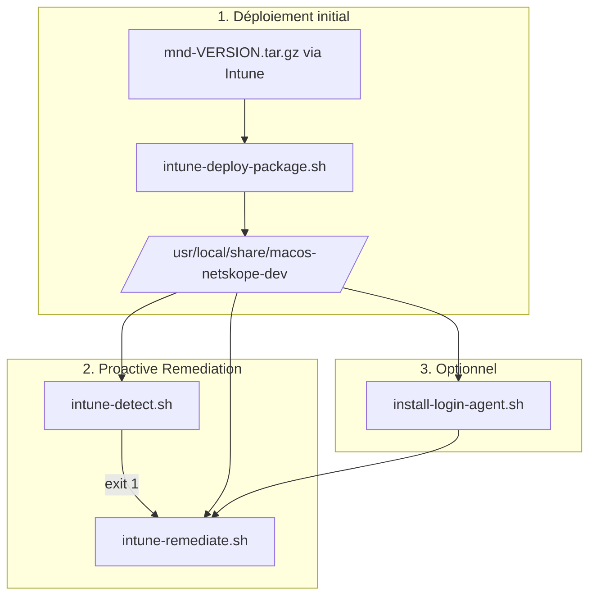

# Guide Microsoft Intune — macos-netskope-dev

Déploiement sur postes macOS gérés par **Microsoft Intune** (Endpoint Manager) pour développeurs Flutter/Android derrière **Netskope**.

## Prérequis

| Prérequis | Détail |
|-----------|--------|
| Intune | Gestion des appareils macOS activée |
| Netskope | Client déployé **avant** ce package (CA dans le Keychain) |
| **Bypass Apple / Xcode** | **Obligatoire pour iOS** — [NETSKOPE-APPLE-IT.md](NETSKOPE-APPLE-IT.md) (admin Netskope) |
| Cible | Développeurs macOS (groupes Entra ID) |
| Privilèges | Scripts Intune exécutés en **root** (contexte appareil) |

> Guide admin général : [ADMIN.md](ADMIN.md)  
> Checklist go-live : [CHECKLIST-IT-FLUTTER.md](CHECKLIST-IT-FLUTTER.md)  
> Bypass Apple (prérequis iOS) : [NETSKOPE-APPLE-IT.md](NETSKOPE-APPLE-IT.md)  
> Guide développeur : [README.md](README.md)

---

## Ordre de déploiement (important)

```
1. Client Netskope
2. Bypass Apple / Xcode (NETSKOPE-APPLE-IT.md)   ← requis pour Flutter iOS
3. Package macos-netskope-dev (ce guide)
4. Xcode + runtimes (développeur — DEV-IOS-XCODE.md)
```

Ne pas déployer uniquement l'étape 3 en supposant qu'iOS fonctionnera.

---

## Architecture Intune



---

## Étape 1 — Construire le package

Sur une machine de build :

```bash
cd macos-netskope-dev
./scripts/build-release.sh
```

Produit :

| Fichier | Usage |
|---------|-------|
| `dist/mnd-VERSION.tar.gz` | Archive à pousser via Intune |
| `dist/mnd-VERSION.tar.gz.sha256` | Vérification d'intégrité |

Communiquez le checksum SHA256 aux administrateurs Intune.

---

## Étape 2 — Déployer l'archive (script macOS Intune)

**Endpoint Manager** → **Appareils** → **macOS** → **Scripts** → **Ajouter**

| Paramètre | Valeur |
|-----------|--------|
| Nom | `macos-netskope-dev — deploy package` |
| Exécuter en tant que | **Root** |
| Notification utilisateur | Masquée |
| Fréquence | Une fois (puis à chaque mise à jour de version) |

Contenu du script (après avoir placé l'archive sur le poste ou téléchargé depuis un partage interne) :

```bash
#!/bin/bash
set -euo pipefail

ARCHIVE="/var/tmp/mnd-VERSION.tar.gz"
INSTALL_DIR="/usr/local/share/macos-netskope-dev"

# Option : télécharger depuis un blob interne
# curl -fsSL "https://interne.example.com/mnd-VERSION.tar.gz" -o "$ARCHIVE"

"$INSTALL_DIR/scripts/intune-deploy-package.sh" "$ARCHIVE" 2>/dev/null || {
  mkdir -p "$INSTALL_DIR"
  tar -xzf "$ARCHIVE" -C /var/tmp
  rm -rf "$INSTALL_DIR"/*
  cp -R /var/tmp/mnd-VERSION/. "$INSTALL_DIR/"
  chmod +x "$INSTALL_DIR/install.sh" "$INSTALL_DIR/scripts/"*.sh
}

"$INSTALL_DIR/scripts/install-login-agent.sh"
```

Adaptez le chemin de l'archive selon votre méthode de distribution (Blob, UNC, package parent Intune).

---

## Étape 3 — Proactive Remediation

**Endpoint Manager** → **Rapports** → **Remédiation proactive** → **Créer un package de scripts**

### Script de détection

| Paramètre | Valeur |
|-----------|--------|
| Type | Détection |
| Exécuter en tant que | **Root** |

```bash
#!/bin/bash
/usr/local/share/macos-netskope-dev/scripts/intune-detect.sh --json
```

**Codes de sortie :**

| Code | Signification | Action Intune |
|------|---------------|---------------|
| `0` | Conforme (ou aucun user console — ignoré) | Aucune remédiation |
| `1` | Non conforme | Lance la remédiation |
| `2` | Erreur (package absent, etc.) | Alerte IT |

### Script de remédiation

| Paramètre | Valeur |
|-----------|--------|
| Type | Remédiation |
| Exécuter en tant que | **Root** |

```bash
#!/bin/bash
/usr/local/share/macos-netskope-dev/scripts/intune-remediate.sh
```

### Planification recommandée

| Paramètre | Valeur |
|-----------|--------|
| Fréquence détection | Quotidienne |
| Ciblage | Groupe Entra « Dev Flutter macOS » |
| Prérequis | Netskope déjà conforme sur le poste |
| Prérequis iOS | Bypass Apple appliqué ([NETSKOPE-APPLE-IT.md](NETSKOPE-APPLE-IT.md)) |

---

## Étape 4 — LaunchDaemon post-connexion (optionnel)

Installé par `install-login-agent.sh` :

- Vérifie toutes les **10 minutes** (configurable) si l'utilisateur console est conforme
- Remédie uniquement si nécessaire (`--login-only`)
- Logs : `/var/log/macos-netskope-dev/login-daemon.log`

Variables :

```bash
export MND_LOGIN_CHECK_INTERVAL=600
/usr/local/share/macos-netskope-dev/scripts/install-login-agent.sh
```

Désinstallation :

```bash
/usr/local/share/macos-netskope-dev/scripts/install-login-agent.sh --uninstall
```

---

## Contrat `--compliance`

Évaluation par utilisateur (contexte home du développeur) :

```bash
./install.sh --compliance
./install.sh --compliance --json
```

### Codes de sortie

| Code | Signification |
|------|---------------|
| `0` | Conforme |
| `1` | Remédiation requise |
| `2` | Erreur d'évaluation |

### Raisons de non-conformité

| Raison | Description |
|--------|-------------|
| `no_manifest` | Jamais installé |
| `missing_stacks` | Stacks `--all` incomplètes |
| `script_version_outdated` | Mise à jour Intune requise |
| `ca_fingerprint_mismatch` | Bundle PEM modifié / rotation CA |
| `gradle_block_missing` | Bloc absent de gradle.properties |
| `shell_block_missing` | Bloc absent du profil shell |

Rapport : `~/.gradle/macos-netskope-dev/compliance-report.json`  
Copie machine : `/var/log/macos-netskope-dev/<user>-compliance.json`

---

## Journalisation

| Fichier | Contenu |
|---------|---------|
| `/var/log/macos-netskope-dev/intune.log` | Détection + remédiation |
| `/var/log/macos-netskope-dev/remediate.log` | Sortie install.sh |
| `/var/log/macos-netskope-dev/login-daemon.log` | LaunchDaemon |

---

## Variables d'environnement

| Variable | Défaut | Usage |
|----------|--------|-------|
| `MND_INSTALL_DIR` | `/usr/local/share/macos-netskope-dev` | Chemin d'installation |
| `MND_LOG_DIR` | `/var/log/macos-netskope-dev` | Journaux |
| `MND_STORE_PASSWORD` | `changeit` | Mot de passe truststore |
| `MND_NETSKOPE_WAIT_SECS` | `300` | Attente CA Netskope |
| `MND_SKIP_IF_NO_USER` | `1` | Détection exit 0 si pas d'user console |

---

## Désinstallation

```bash
TARGET_USER="$(/usr/bin/stat -f%Su /dev/console)"
INSTALL="/usr/local/share/macos-netskope-dev"

"$INSTALL/scripts/install-login-agent.sh" --uninstall 2>/dev/null || true

if [[ -n "$TARGET_USER" && "$TARGET_USER" != "root" ]]; then
  sudo "$INSTALL/install.sh" --as-user "$TARGET_USER" --rollback
fi
```

---

## Références

- [Scripts macOS Intune](https://learn.microsoft.com/mem/intune/apps/macos-shell-scripts)
- [Remédiation proactive](https://learn.microsoft.com/mem/intune/fundamentals/proactive-remediations)
- [CHECKLIST-IT-FLUTTER.md](CHECKLIST-IT-FLUTTER.md)
- [NETSKOPE-APPLE-IT.md](NETSKOPE-APPLE-IT.md)
- [ADMIN.md](ADMIN.md)
