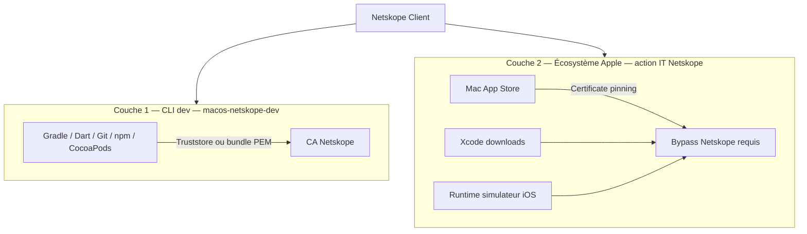

# Guide IT — Apple, Xcode et App Store derrière Netskope

Document destiné aux **administrateurs réseau / sécurité Netskope** et aux **équipes IT** déployant des postes **Flutter iOS/macOS**.

> **Public :** admin Netskope, IT endpoint, responsable sécurité  
> **Complète :** [CHECKLIST-IT-FLUTTER.md](CHECKLIST-IT-FLUTTER.md) (ordre de déploiement global)  
> **Ne remplace pas :** [ADMIN.md](ADMIN.md) (script macos-netskope-dev) ni [INTUNE.md](INTUNE.md)

---

## 1. Problème et périmètre

### 1.1 Ce que fait macos-netskope-dev

Le script configure les **outils CLI** du développeur Flutter (Gradle, Dart, Git, npm, CocoaPods, curl…) pour faire confiance à la **CA Netskope** via truststore ou bundle PEM.

Voir [README.md](README.md) — matrice des stacks.

### 1.2 Ce qu'il ne fait **pas**

| Besoin Flutter iOS | Géré par le script ? | Qui doit agir ? |
|--------------------|----------------------|-----------------|
| `flutter pub get`, Gradle, `pod install` | **Oui** (stacks CLI) | Script + [ADMIN.md](ADMIN.md) |
| **Installation Xcode** (Mac App Store ou .xip) | **Non** | **IT Netskope** (ce document) |
| **Téléchargement runtimes simulateur** (Xcode → Platforms) | **Non** | **IT Netskope** |
| **Connexion Apple ID** dans Xcode | **Non** | **IT Netskope** |
| App HTTPS **en simulateur** (runtime) | Partiel (`--simulator`) | Dev + script ; prérequis Xcode installé |
| Notarisation / App Store Connect API | **Non** | **IT Netskope** (domaines Apple Developer) |

### 1.3 Pourquoi la CA Netskope dans le Keychain ne suffit pas

Les applications Apple (App Store, composants de Xcode) utilisent le **certificate pinning** : elles vérifient que le certificat serveur correspond à une empreinte **codée en dur**, indépendamment du Keychain macOS.

Netskope intercepte le TLS et présente **sa propre CA** → l'application Apple **refuse** la connexion.

**Position officielle Apple** ([Use Apple products on enterprise networks](https://support.apple.com/en-gb/101555)) :

> *Apple services will fail any connection that uses HTTPS Interception (SSL Inspection).*

**Conséquence pour la décision entreprise :** il n'existe **pas** de contournement « injecter la CA Netskope dans Xcode ». Les options réalistes sont **bypass Netskope** (steering ou SSL Decryption) pour les domaines/processus Apple, ou **réseau non inspecté** pour les postes dev.

---

## 2. Architecture : deux couches TLS



Sans **couche 2**, un développeur peut avoir `./install.sh --status` OK et rester **bloqué** sur l'installation de Xcode ou des simulateurs.

---

## 3. Options Netskope — comparatif pour décision

Netskope distingue deux types de bypass ([Add Bypasses in Netskope](https://docs.netskope.com/en/add-bypasses-in-netskope/)) :

| Type | Trafic vers Netskope Cloud ? | Inspection SSL ? | Visibilité sécu | Recommandation Apple |
|------|------------------------------|------------------|-----------------|----------------------|
| **Steering bypass** | Non (direct Internet) | Non | Faible sur ce trafic | **Adapté** aux apps épinglées |
| **SSL Decryption bypass** (Do Not Decrypt) | Oui | Non | Moyenne (métadonnées) | Acceptable si steering bypass impossible |
| **Inspection SSL active** | Oui | Oui | Élevée | **Incompatible** App Store / pinning Apple |

### 3.1 Matrice de décision entreprise

| Politique sécurité | Option recommandée | Impact développeur |
|--------------------|--------------------|--------------------|
| Standard — groupe dev ciblé | CPA **Apple App Store** + bypass domaines Apple **uniquement** pour le groupe Entra « Dev Flutter macOS » | Xcode et Store fonctionnels |
| Stricte — zero bypass élargi | Poste dev sur **VLAN sans inspection** ou installation Xcode **hors réseau inspecté** (procédure documentée) | Friction à l'onboarding |
| Maximale visibilité | SSL Decryption bypass (pas steering) sur liste fine de domaines Apple | Compromis sécu / fonctionnel |

### 3.2 Justification audit (texte réutilisable)

> Les services Apple (App Store, Xcode, authentification Apple ID) implémentent un certificate pinning conforme à leur modèle de sécurité plateforme. L'inspection SSL entreprise provoque l'interruption volontaire de ces connexions (comportement documenté par Apple). Le bypass ciblé sur les domaines et processus Apple listés dans la documentation Apple enterprise, limité au groupe des développeurs mobiles, permet de maintenir l'inspection SSL sur le reste du trafic utilisateur tout en garantissant la productivité des équipes Flutter iOS.

---

## 4. Étape par étape — configuration Netskope

### Étape 0 — Prérequis

- [ ] Accès admin **tenant Netskope**
- [ ] Groupe d'utilisateurs ou **OU** identifiant les postes **Dev Flutter macOS**
- [ ] Client Netskope déployé sur les Mac cibles (Intune, Jamf, etc.)
- [ ] macos-netskope-dev planifié **après** le client Netskope ([CHECKLIST-IT-FLUTTER.md](CHECKLIST-IT-FLUTTER.md))

---

### Étape 1 — Vérifier le CPA prédéfini « Apple App Store » (Mac)

**Justification :** Netskope inclut **Apple App Store (Mac)** dans les [Certificate Pinned Applications](https://docs.netskope.com/en/certificate-pinned-applications/) prédéfinies — le trafic **contourne le cloud Netskope par défaut**.

1. Connexion à l'**admin console Netskope**
2. **Settings** → **Security Cloud Platform** → **Steering Configuration**
3. Ouvrir la config appliquée aux postes dev (on-prem / off-prem si **Dynamic Steering**)
4. Onglet **Exceptions** → vérifier la présence de **Apple App Store** (Mac), action **Bypass**

> Si Dynamic Steering est activé, répéter pour **On-Premises** et **Off-Premises**.

**Si absent ou bloqué :**

1. **Exceptions** → **New Exception**
2. Type : **Certificate Pinned Application**
3. Application : **Apple App Store** (prédéfinie, Mac)
4. Action : **Bypass**

**Validation :**

- Sur un Mac dev connecté, ouvrir **App Store** → recherche « Xcode » (sans installer)
- Consulter `nsdebuglog.log` client : pas d'erreur certificat sur processus App Store

---

### Étape 2 — Bypass SSL Decryption pour domaines Apple (Xcode, simulateurs, Apple ID)

**Justification :** L'App Store seul ne couvre pas tous les téléchargements Xcode (`devimages-cdn.apple.com`, `gdmf.apple.com`, etc.) ni l'authentification Apple ID.

**Policies** → **SSL Decryption** → **Add Policy** (ou modifier politique existante pour le groupe dev)

| Paramètre | Valeur recommandée |
|-----------|-------------------|
| **Action** | **Do Not Decrypt** / Bypass |
| **Ciblage** | Groupe **Dev Flutter macOS** uniquement |
| **Critère** | Domaines (liste ci-dessous) |

#### Liste minimale (Flutter / Xcode)

Source : [Apple — enterprise network hosts](https://support.apple.com/en-gb/101555)

| Domaine | Usage |
|---------|--------|
| `*.apps.apple.com` | Mac App Store, contenu apps |
| `*.itunes.apple.com` | Store, métadonnées |
| `*.mzstatic.com` | Assets Store |
| `devimages-cdn.apple.com` | Composants Xcode, images simulateur |
| `download.developer.apple.com` | Téléchargements Developer |
| `gdmf.apple.com` | MobileAsset (runtimes simulateur, mises à jour) |
| `appleid.apple.com` | Authentification Apple ID |
| `idmsa.apple.com` | Authentification |
| `gsa.apple.com` | Services Apple Account |
| `account.apple.com` | Compte Apple |

#### Liste étendue (recommandée si problèmes persistants)

| Domaine | Usage |
|---------|--------|
| `*.icloud.com` | iCloud (parfois lié aux téléchargements) |
| `*.apple-cloudkit.com` | Services cloud Apple |
| `ocsp.apple.com` | Validation certificats |
| `crl.apple.com` | Listes de révocation |
| `ppq.apple.com` | Validation apps entreprise |

> **Alternative large :** `*.apple.com` + `*.mzstatic.com` — plus simple à maintenir, surface de bypass plus large. À arbitrer avec la sécurité.

**Note Apple :** plusieurs hôtes Xcode indiquent « Supports proxies : — » — un proxy **avec inspection** reste incompatible ; le bypass SSL est requis.

**Validation :**

```bash
# Sur Mac dev ( après propagation policy ~15 min )
# Téléchargement test léger — ou Xcode → Settings → Platforms → télécharger un runtime
curl -sI https://devimages-cdn.apple.com/ | head -1
curl -sI https://gdmf.apple.com/ | head -1
```

---

### Étape 3 (optionnel) — CPA custom par processus

**Justification :** Si le bypass par domaine est insuffisant (processus non couverts, logs Netskope ambigus).

1. Reproduire l'échec sur Mac dev (ex. ouverture App Store, Xcode → Platforms)
2. Exporter les logs client Netskope (`nsdebuglog.log`) à l'horodatage de l'erreur
3. Identifier **process name** et **destination**

**Settings** → **Security Cloud Platform** → **App Definition** → **Certificate Pinned Apps** → **New Custom**

| Application | Platform | Process (exemples Mac, minuscules) |
|-------------|----------|----------------------------------|
| Mac App Store agents | Mac | `storeagent`, `appstoreagent` |
| Xcode | Mac | `xcode`, `com.apple.dt.xcode` |

4. Ajouter la CPA en **Exception** steering → **Bypass**
5. Documenter dans le runbook interne

Référence : [Creating custom CPA](https://docs.netskope.com/en/certificate-pinned-applications/) — [Dell KB CPA](https://www.dell.com/support/kbdoc/en-us/000180641/how-to-allow-or-block-a-certificate-pinned-application-with-netskope)

---

### Étape 4 — Ne pas inspecter le trafic DevTools Apple via « Steer and Decrypt »

Netskope propose « Steer and Decrypt » pour certains CPA/DevTools — **ne l'appliquez pas** aux processus Apple épinglés. Conserver **Bypass** uniquement.

---

### Étape 5 — Content Caching Apple (optionnel, performance)

**Justification :** Réduit bande passante et temps de téléchargement Xcode/simulateurs sur le site ; **ne remplace pas** le bypass SSL.

- Déployer un Mac ou serveur **Content Caching** ([Apple — content caching](https://support.apple.com/guide/mac-help/mchlp1488/mac))
- Autoriser les Mac dev à utiliser le cache local
- Les bypass Netskope restent **obligatoires** pour les apps épinglées

---

## 5. Ordre de déploiement avec macos-netskope-dev

```
1. Client Netskope + CA dans Keychain
2. Bypass Apple (étapes 1–2 de ce document)     ← AVANT Xcode
3. macos-netskope-dev (--all --netskope)
4. Intune Proactive Remediation (optionnel)
5. Développeur : installation Xcode + runtimes
6. Développeur : --simulator si tests HTTPS simulateur
```

Détail : [CHECKLIST-IT-FLUTTER.md](CHECKLIST-IT-FLUTTER.md)

---

## 6. Validation bout-en-bout (poste pilote)

Checklist sur **un Mac dev** du groupe pilote :

| # | Test | Succès attendu |
|---|------|----------------|
| 1 | `./install.sh --list-netskope` | ≥ 1 certificat Netskope |
| 2 | App Store → recherche Xcode | Pas d'erreur réseau/certificat |
| 3 | Installation ou mise à jour Xcode | Téléchargement démarre |
| 4 | Xcode → Settings → Platforms → runtime iOS | Téléchargement OK |
| 5 | `./install.sh --all --netskope --yes` puis `--compliance` | Exit 0 |
| 6 | `flutter doctor` | Xcode indiqué OK |
| 7 | `flutter pub get` + `cd ios && pod install` | Succès |
| 8 | Simulateur booté + `./install.sh --simulator --netskope` | Pas d'erreur -1200 sur API dev |

---

## 7. Dépannage IT

| Symptôme | Cause probable | Action |
|----------|----------------|--------|
| App Store vide / « cannot connect » | Inspection SSL active sur Apple | Étape 1–2, vérifier Dynamic Steering |
| Xcode bloqué sur « Downloading » | `gdmf.apple.com` ou `devimages-cdn.apple.com` inspecté | Ajouter domaines étape 2 |
| `--status` OK mais Xcode KO | Couche 1 OK, couche 2 manquante | Ce document, pas le script |
| Échec après changement policy | Propagation client (~15 min) | Attendre ou forcer check-in Netskope |
| Entrée `/etc/hosts` bloque Apple | Blocage local (MDM, sécu) | Vérifier `gdmf.apple.com`, `*.apple.com` |
| VPN entreprise + Netskope | Double proxy | Tester bypass ou split tunnel |
| macos-netskope-dev OK, simulateur -1200 | Runtime simulateur | Dev : [simulator.md](stacks/simulator.md) |

**Collecte logs Netskope :**

1. Reproduire l'erreur en notant l'heure exacte
2. Exporter bundle logs client Netskope
3. Chercher dans `nsdebuglog.log` : process, SNI, erreur certificat

---

## 8. Modèle de ticket / demande changement

```
Titre : Bypass Netskope — développeurs Flutter iOS (Apple / Xcode)

Contexte :
Les développeurs Flutter iOS nécessitent Xcode (Mac App Store) et les runtimes
simulateur. Les services Apple utilisent le certificate pinning et échouent
sous inspection SSL (documentation Apple HT210060 / Netskope CPA).

Demande :
1. Confirmer CPA prédéfinie "Apple App Store" (Mac) en Bypass pour [GROUPE DEV]
2. Politique SSL Decryption "Do Not Decrypt" pour :
   *.apps.apple.com, *.itunes.apple.com, *.mzstatic.com,
   devimages-cdn.apple.com, download.developer.apple.com, gdmf.apple.com,
   appleid.apple.com, idmsa.apple.com, gsa.apple.com, account.apple.com
   — ciblage : [GROUPE DEV] uniquement

Justification :
- Inspection SSL incompatible (pinning Apple) — pas d'alternative technique
- Bypass limité au groupe dev, pas à l'ensemble de l'entreprise
- macos-netskope-dev couvre les CLI ; ce changement couvre Xcode/Store

Validation :
- Checklist section 6 de docs/NETSKOPE-APPLE-IT.md sur poste pilote [NOM]

Références :
- https://support.apple.com/en-gb/101555
- https://docs.netskope.com/en/certificate-pinned-applications/
```

---

## 9. Références

| Source | URL |
|--------|-----|
| Apple — réseaux entreprise | https://support.apple.com/en-gb/101555 |
| Netskope — CPA | https://docs.netskope.com/en/certificate-pinned-applications/ |
| Netskope — Bypasses | https://docs.netskope.com/en/add-bypasses-in-netskope/ |
| Netskope — DevTools | https://community.netskope.com/next-gen-swg-2/configuring-developer-tools-with-netskope-ssl-inspection-8493 |
| macos-netskope-dev — admin | [ADMIN.md](ADMIN.md) |
| Checklist déploiement | [CHECKLIST-IT-FLUTTER.md](CHECKLIST-IT-FLUTTER.md) |
| Guide développeur iOS | [DEV-IOS-XCODE.md](DEV-IOS-XCODE.md) |
